# IaC-With-Terraform

## Overview

This Project is about showing how Terraform is used as an Infrastructure as code to build resources in AWS using services like:
-  AWS SNS
-  AWS Lambda (Lambda Function)
-  AWS Glue (Glue Job)
-  AWS S3
-  Amazon DynamoDB
-  Amazon Kinesis (Kinesis Stream and Amazon Data Firehose)

## Code Overview
The pipeline consists of the following components:

- **S3 Bucket (data-bucket):** Stores raw data for processing.

- **Lambda Function (etl-lambda):** Processes data uploaded to the S3 bucket and writes it to DynamoDB.

- **DynamoDB Table (target-table):** Stores the processed data.

- **Glue Job (my-glue):** Orchestrates the data processing logic defined in a Python script.

- **SNS Topic (user-updates):** Publishes notifications about data processing events.

- **Kinesis Stream (test-stream):** Streams data for real-time processing.

- **Kinesis Firehose Delivery Stream (extended_s3_stream):** Delivers data from the Kinesis stream to an S3 bucket with additional processing using a Lambda function.

- **S3 Bucket (bucket):** Stores the processed data delivered by the Kinesis Firehose.

- **Lambda Function (firehose_lambda_processor):** Processes data delivered by the Kinesis Firehose before storing it in the S3 bucket.

## Deployment and Usage
### Prerequisites:
- Configure AWS credentials and region in your Terraform environment.
- Install Terraform and the AWS provider plugin.
### Deployment:
- Update the `source_bucket_name` and `destination_bucket_name` variables in the variables.tf file with your desired bucket names.
- **Initialize Terraform:** `terraform init`
- **Apply the Terraform configuration:** `terraform apply`

## Testing
- Upload data to the data-bucket.
- The etl-lambda function will be triggered and process the data, storing the results in the target-table.
- Optionally You can publish messages to the user-updates topic to trigger notifications.
- Optionally Send data to the test-stream for real-time processing and storage in the bucket.

## Images
Below are images that shows the different resources in AWS.

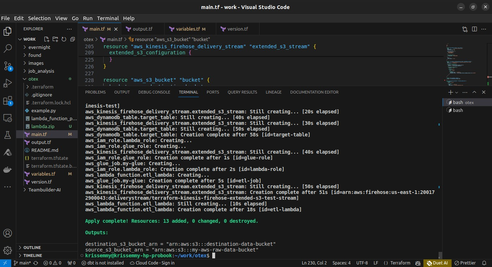
*Terminal Result of Successful Resource Creation*

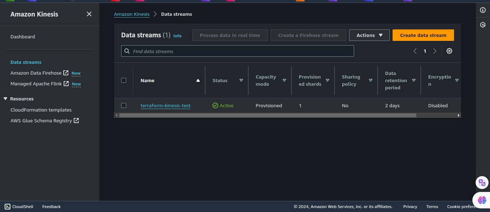
*Kinesis Data Stream*

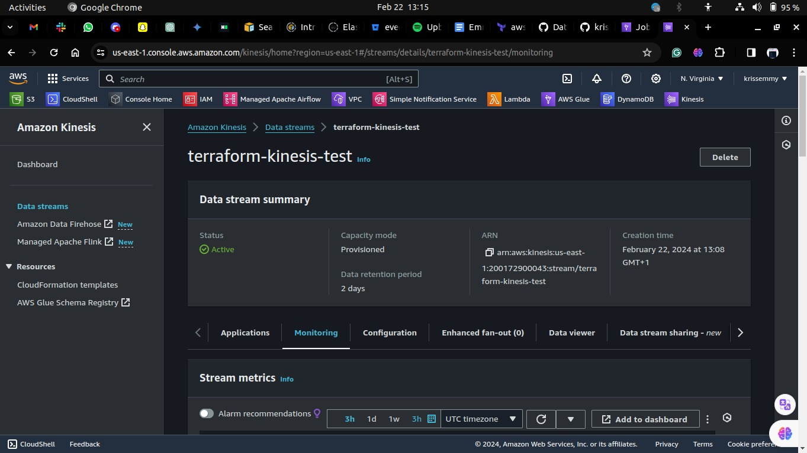
*Kinesis Data Stream(detailed)*

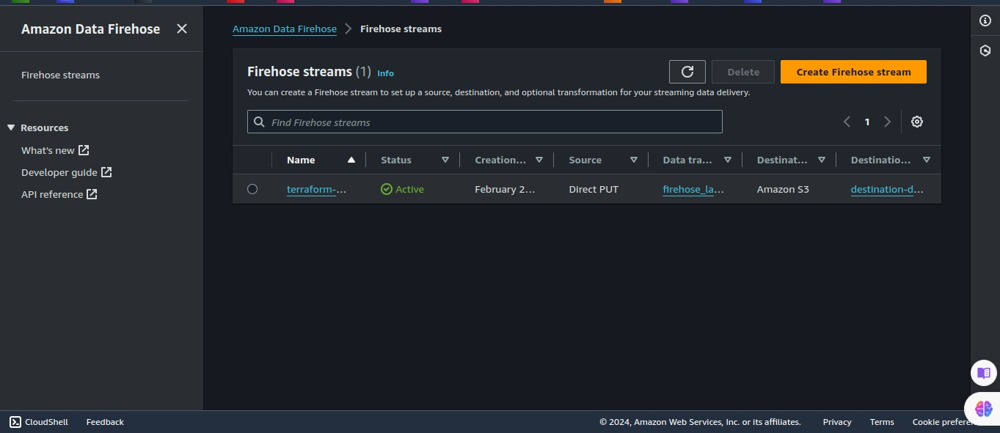
*Amazon Data FireHose*

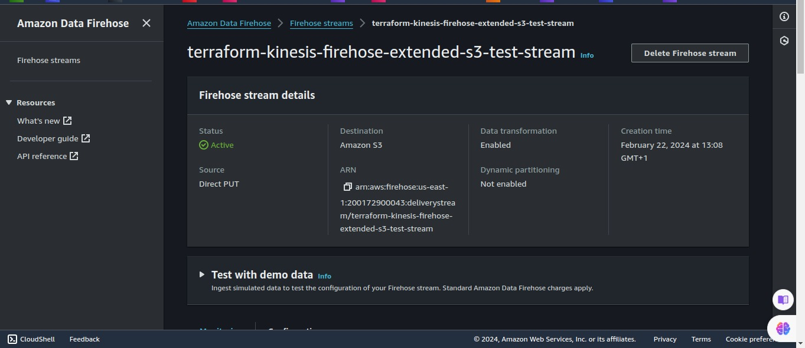
*Amazon Data FireHose(detailed)*

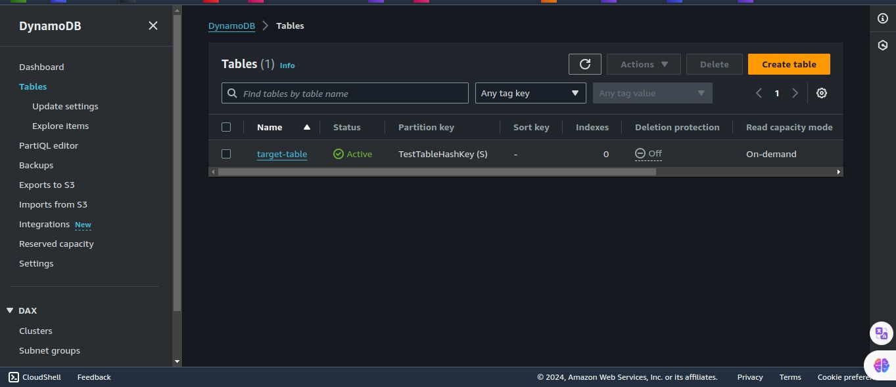
*DynamoDB Table*

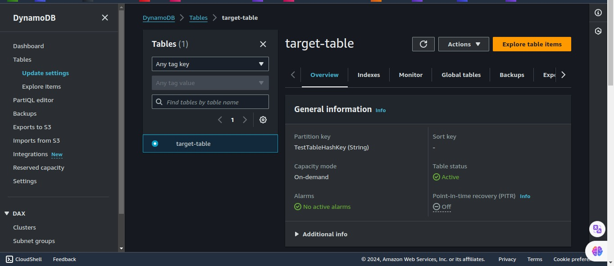
*DynamoDB Table(detailed)*

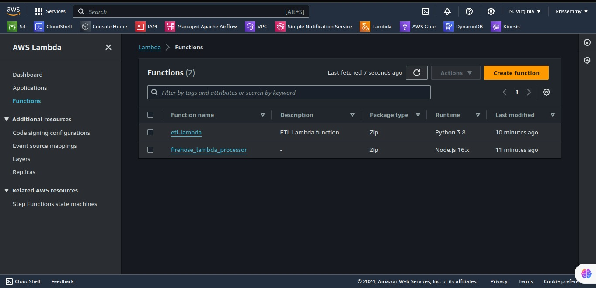
*Lambda Functions*

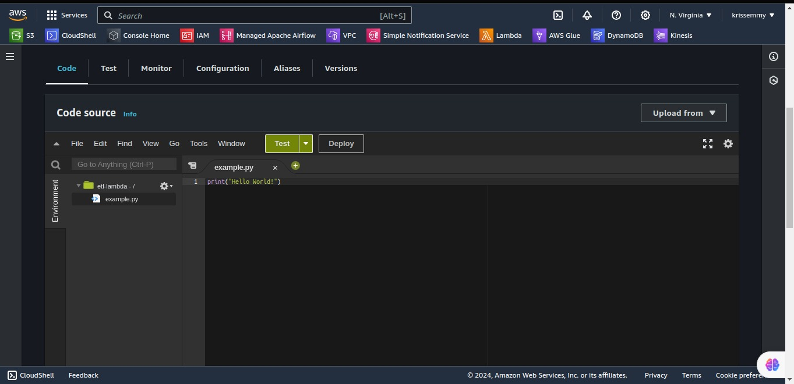
*Lambda Function code*

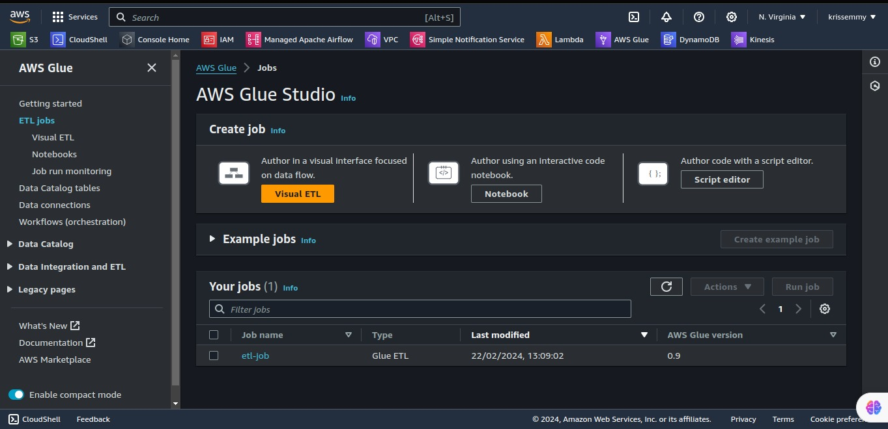
*Glue Job*

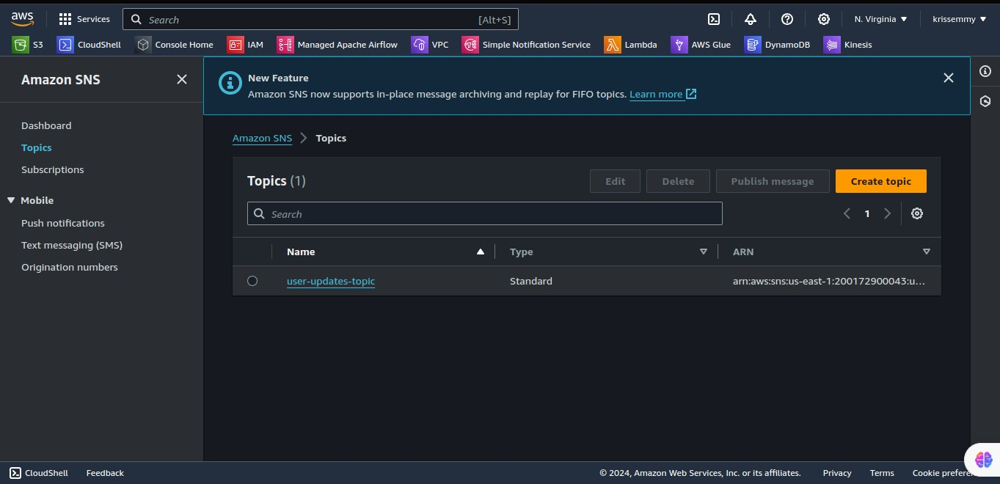
*SNS Topic*

*The Two S3 Buckets*

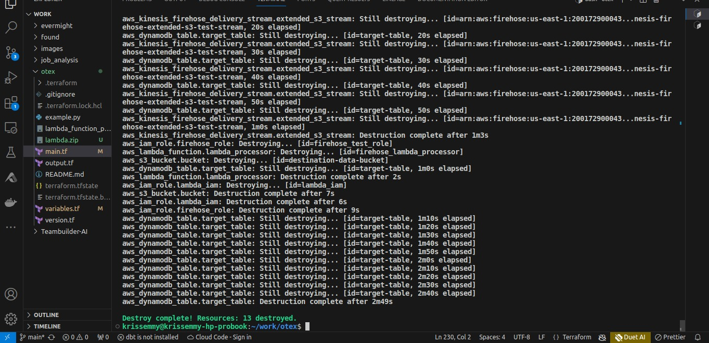
*Terminal Result of Resources Destroyed Successfully*